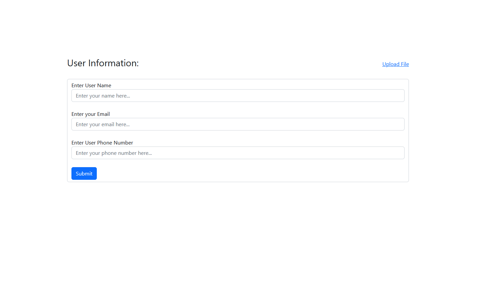

**
Module-14 Assignment
**

 

**API Endpoint list:**

- **localhost:8000/api/store (POST)** - please fill up the input fields from body->form-data before sending the request or simply use it from application homepage **web routes**.
- **localhost:8000/api/user-agent  (GET)** - Please select **GET** Method to before sending request
- **localhost:8000/api/query/?page=my page (GET)** or **localhost:8000/api/query (GET)** - please set the value in params tabs set **page** for the key and **your value** in value input before sending the request.
- **localhost:8000/api/json-response (GET)**
- **localhost:8000/api/upload (POST)** - Go to body tab on postman select form-data create a input key named **avatar** select file from the right side and upload your image in value field
    then send the request. OR click upload file link from the homepage **web routes**.
- **localhost:8000/api/get-cookie (GET)** - before using the endpoint create a cookie on postman under localhost:8000/ domain set the key = 'remember_token' & value = "as your wish".

- **localhost:8000/api/submit (POST)** - Please make a email input and provide a value on request body before sending the endpoint.

 

